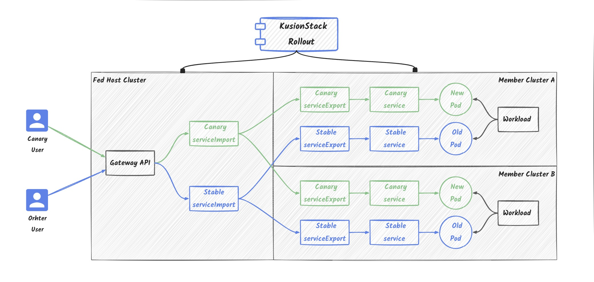
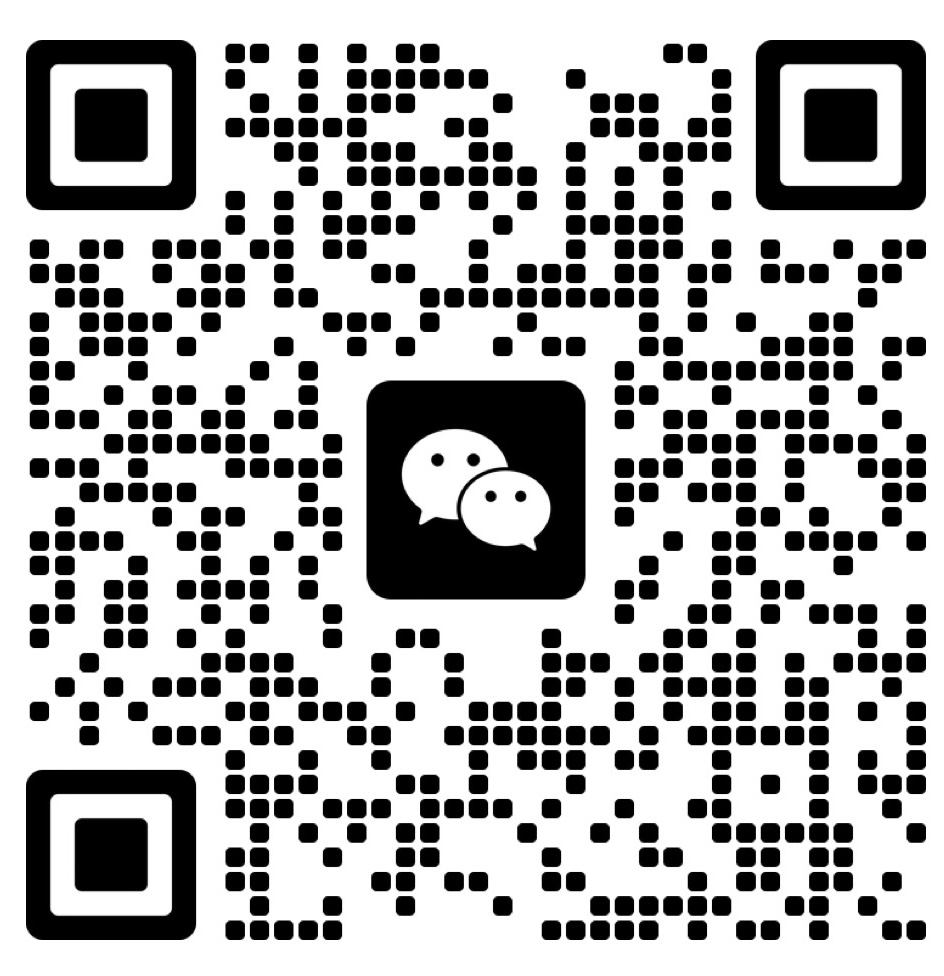

# KusionStack Rollout

## Overview

KusionStack Rollout is a progressive delivery controller that automates the release process for applications running on Kubernetes **Clusterset**.
It provides several delivery strategies such as Canary release, Blue/Green mirroring, A/B testing to reduce the risk of introducing a new version in production. It can also integrates with GatewayAPI, leveraging its traffic shaping ablibities to gradually shift traffic to the new version.  

> The terminology **clusterset** is defined in [KEP-1645: Multi-Cluster Services API](https://github.com/kubernetes/enhancements/tree/master/keps/sig-multicluster/1645-multi-cluster-services-api). 
> 
> clusterset - A placeholder name for a group of clusters with a high degree of mutual trust and shared ownership that share services amongst themselves. Membership in a clusterset is symmetric and transitive. The set of member clusters are mutually aware, and agree about their collective association. Within a clusterset, namespace sameness applies and all namespaces with a given name are considered to be the same namespace. Implementations of this API are responsible for defining and tracking membership in a clusterset. The specific mechanism is out of scope of this proposal.

## Key Features

- Supports progressive delivery for **Multi Cluster application** with multiple components.
- Supports various kinds of workload, such as StatefulSet, CollaSet.
- Supports several delivery strategies, suck as Canary release, Multi Batch, Blue/Green mirroring, A/B testing.
- Supports fine-grained traffic shifting with [GatewayAPI](https://gateway-api.sigs.k8s.io)
- Extends rollout progress with webhook

## Quick Start

See [Getting Started Guide](docs/en/quick_start.md) to walk through creating and then updating the rollout in local kind cluster.

## Contributing

Please refer to [Contributing](CONTRIBUTING.md)

## Code of Conduct

Please refer to [Code of Conduct](CODE_OF_CONDUCT.md) for more details.

## Contact us
- Twitter: [KusionStack](https://twitter.com/KusionStack)
- Slack: [Kusionstack](https://join.slack.com/t/kusionstack/shared_invite/zt-19lqcc3a9-_kTNwagaT5qwBE~my5Lnxg)
- DingTalk (Chinese): 42753001
- Wechat Group (Chinese)

  

## License

This project follows [Apache-2.0 License](LICENSE).
